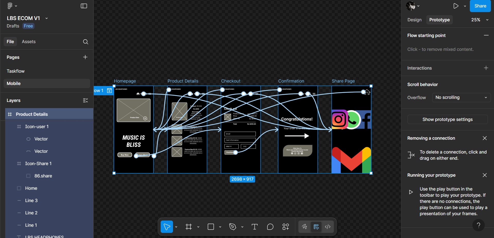
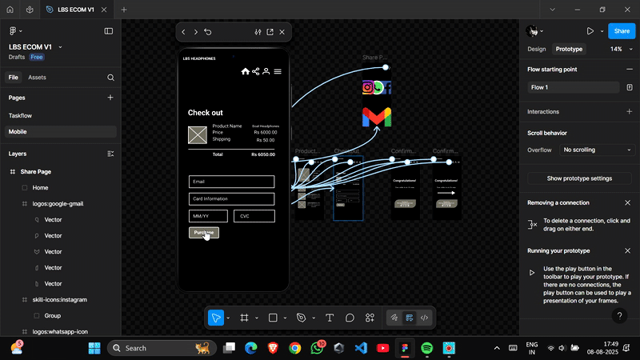
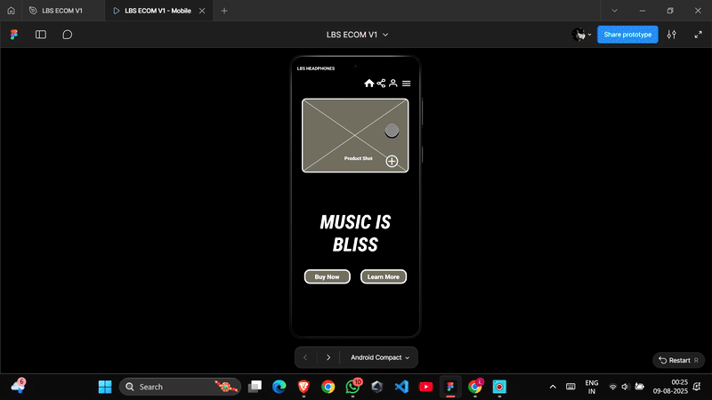

# Basic-ui-ux-ecommerce-web-app-wireframe
This is my first UI/UX design project created using figma,this is a basic ecommerce web app wireframe created using figma

# Basic E-Commerce Web App Wireframe (Figma)

A clean and minimal **e-commerce web app wireframe** designed in **Figma**, showcasing the basic user journey — from browsing products to checkout and confirmation.

---

## 📌 Project Info
- **Name:** Basic E-Commerce Web App Wireframe  
- **Tools Used:** Figma  
- **Prototype Link:** [View Figma Prototype](https://www.figma.com/proto/NYvOXYrxH8zQkB6xseKxrB/LBS-ECOM-V1?node-id=0-1&t=igpguv0CH2N1ntf6-1)  

---

## 🎯 Features
- 🏠 **Homepage** — Simple and user-friendly layout  
- 📦 **Product Details Page** — Clean product presentation  
- 💳 **Checkout** — Minimal step-by-step process  
- ✅ **Confirmation Page** — Order success feedback  

---

## 📸 Screenshots

  
  

---

## 🎥 Prototype Previews

**UX E-Commerce Flow**  
  

**E-Commerce Prototype View**  
  

---

## 📂 Figma Source File
You can download and open the original Figma project in your own Figma account to explore layers, components, and design flow.

➡ [Download `.fig` file](assets/LBS%20ECOM%20v1.fig)  

---

## 🚀 How to View the `.fig` File
1. Download the `.fig` file above.  
2. Go to [Figma.com](https://figma.com) and log in.  
3. Click on **Import File** and select the `.fig` file.  
4. Explore the full design project.

---

## 🎥 Demo Videos
### 1️⃣ UX Ecom – Full Walkthrough  
![UX Ecom Demo]

### 2️⃣ Ecom Prototype View – Quick Preview  
![Ecom Prototype View Demo]

---

## 📂 How to View
1. Click the **Live Prototype** link above  
2. Use Figma’s play mode to navigate through the design  
3. Interact with clickable areas to explore the wireframe

---

## 📌 About the Project
This project was created to demonstrate:
- Basic e-commerce wireframe creation
- Clean UI layout for essential pages
- User flow from product selection to purchase confirmation

---

## 📧 Contact
If you have feedback or opportunities, feel free to connect:  
**LinkedIn:** [www.linkedin.com/in/likhith-bs-07b62330b]  

